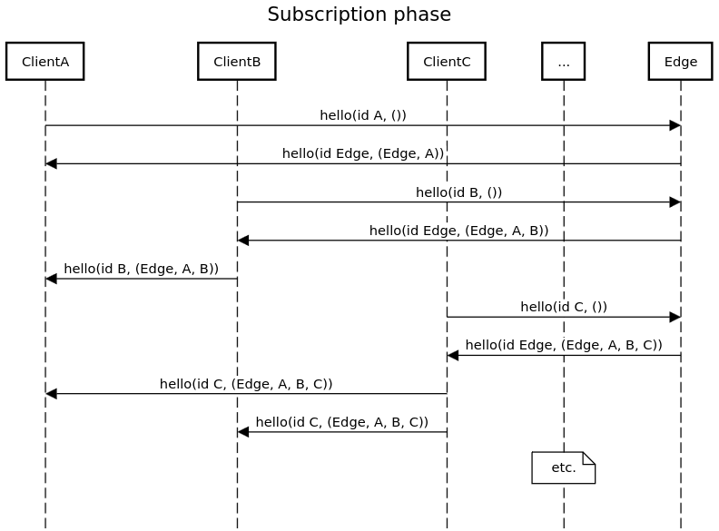
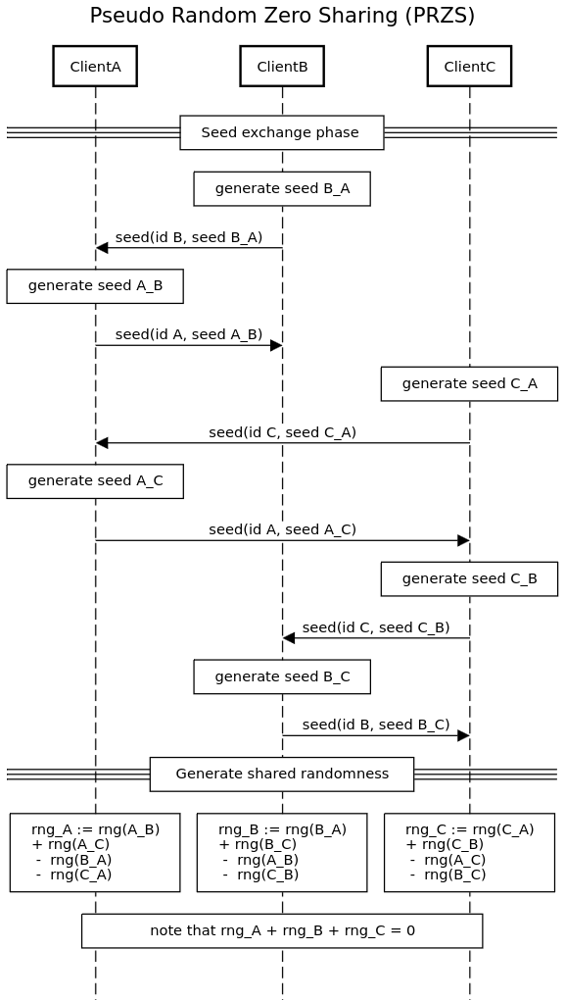
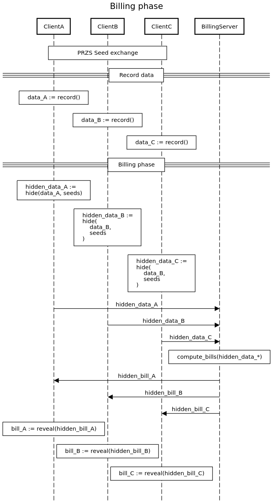

# Billing Protocol
The private billing protocol consists of three phases:
- subscribing to the network,
- setting up PRZS
- executing billing

We briefly discuss each phase.

## Subscription phase
This implementation uses a central entity (`MarketOperator`) as "gateway" to the peer-to-peer network.
Upon registring with the gateway, a peer receives the identities of all other registered peers and the billing server.
The peer is then expected to register with each of these peers as well as the billing server.
The peers must know each other to achieve [proper PRZS for data hiding](./protocol.md); the billing server needs to know who to expect data from in a billing round.

The below diagram illustrates the messages sent during a subscription phase with three peers.

## Seed Exchange phase
For PRZS to properly function, each pair of peers needs to exchange two RNG seeds.
The below diagram illustrates the message exchange during this phase.

Note that the `hello` messages and `seed` messages follow an identical pattern. As such, the `seed` messages are used as `hello` messages in the implementation.

## Billing phase
With PRZS set up, the peer can start to consume/produce energy and submit their consumption/production data for billing.
Once data is received from all peers, the billing server combines all data and executes the billing procedure.
Once completed, each bill is sent to the respective peer.

The message exchange is illustrated in the following diagram.

