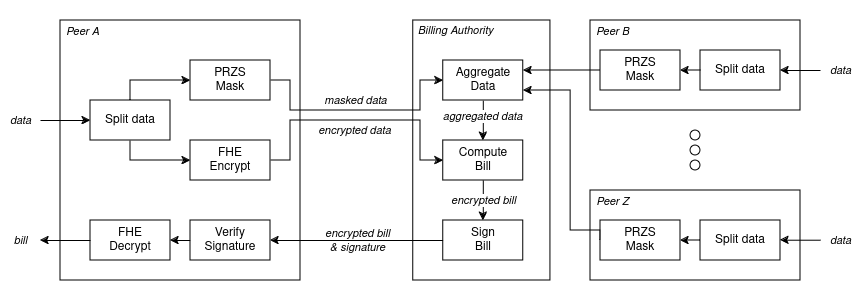

# The Private Billings Library

## Components
This library consists of two primary modules:
- [core](../src/private_billing/core): the core components used in the billing process.
- [server](../src/private_billing/server): the server utilities establishing a billing network and facilitating the billing process.

We briefly discuss both parts

## Core
We explain the `core` module using the following figure.



A peer creates a `Data` object containing its prediction and actual consumption/production data.
Using a `HidingContext`, this data is split into parts (_Split Data_) and hidden (`.hide`), forming a `HiddenData` object, containing both _PRZS masked_ and _FHE encrypted_ data.
This object can the be `.serialize`d, sent over, `.deserialize`d and provided to the `SharedBilling` component, which resides at the _Billing Authority_. Once the Billing Authority has received the `HiddenData` of all network peers, as well as a `CycleContext` object with billing context information, the `SharedBilling` starts to `.compute_bills`.
It returns `HiddenBill`s as a result, which can be `.serialize`d, sent back to each peer and `.deserialize`d. 
The peer can then `.decrypt`s their `HiddenBill` to get the final, plain `Bill`.

## Server
In this library, a billing network has two types of servers:
1. [`core`](../src/private_billing/core_server.py); server acting on behalf of a household, submitting consumption/production data and receiving incoming bills/rewards.
2. [`edge`](../src/private_billing/edge_server.py); server acting as the gate to the peer-to-peer community. Cores start with connecting to an edge, after which they synchronize with the rest of the network. The edge also takes care of generating the bills/rewards.

Launching an edge or core is as simple as:
```python
from private_billing import launch_edge, launch_core
launch_edge(...)
launch_core(...)
```

### Talking to a server
To talk to a server, you only need the following code:
```python
import zmq
from private_billing.server import TCPAddress, PickleEncoder

def send(msg: Message, address: TCPAddress):
    ctxt = zmq.Context()
    sock = ctxt.socket(zmq.REQ)
    with sock.connect(str(address)):
        enc = PickleEncoder.encode(msg)
        sock.send(enc)
        repl = sock.recv()
    return PickleEncoder.decode(repl)
```

### Submitting data
Once the network is up, billing can start.
To submit a bill to a core server at `core_address`, simply execute the following
```python
from private_billing.core import Data
from private_billing.messages import DataMessage

data = Data(...) # your data
msg = DataMessage(None, data)
send(msg, core_address)
```

Note here that `Data` requires `vector`s as input.

### Submitting Cycle Context
Before being able to compute bills, the `edge` server needs context of the billing cycle.
This is sent as follows:
```python
from private_billing.core import CycleContext
from private_billing.messages import ContextMessage

cyc = CycleContext(...) # your context info
msg = ContextMessage(None, cyc)
send(msg, edge_address)
```

### Getting a Bill
Once an edge has received all data and a context for a given billing cycle, it will automatically compute the bills and distribute them to each peer.
To get the bill from a core server, execute the following:
```python
from private_billing.messages import GetBillMessage

gmb = GetBillMessage(None, ...) # your cycle id
resp = send(msg, core_address)
```